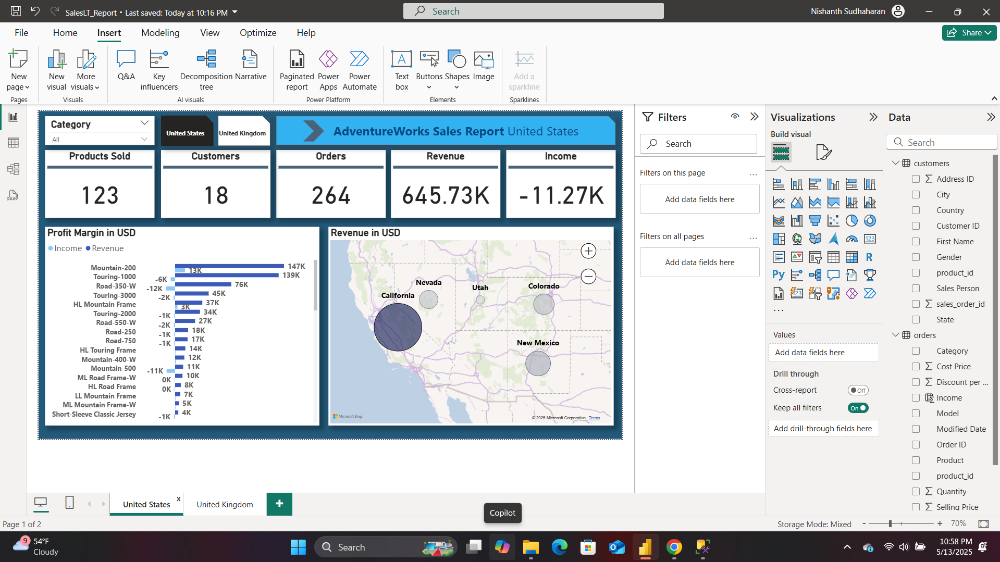

# Azure Data Engineering Pipeline and Power BI Report: Sales Data

## Overview

This project delivers a full-scale Azure-based data engineering pipeline that addresses a critical business requirement. The objective is to extract customer and sales data from an on-premises SQL Server database, process and transform the data in the cloud, and deliver actionable insights through a Power BI dashboard.

The dashboard enables stakeholders to explore sales pattern, demographics and their relationship to product sales by allowing filtering by product category, and country.

---
## What value does this project bring to a business?
This project is highly valuable in the real world because it empowers businesses with timely, data-driven insights into their sales performance across different regions and product categories. By automating data ingestion, transformation, and visualization, the solution reduces manual reporting overhead while ensuring that decision-makers have access to up-to-date information.

The Power BI dashboard allows stakeholders to track key metrics like revenue, income, customer count, and product performance at a glance, making it easier to identify trends, detect issues (e.g., negative income), and optimize operations and marketing strategies. This leads to better-informed decisions that drive growth and efficiency.
---

## Solution Architecture

The solution is structured into the following major components:

### Data Ingestion
- Extract customer and sales data from an on-premises SQL Server.
- Load raw data into Azure Data Lake Storage (ADLS) using Azure Data Factory (ADF).

### Data Transformation
- Use Azure Databricks to process and cleanse data.
- Organize data into the following layers:
  - **Bronze**: Raw data
  - **Silver**: Cleansed data
  - **Gold**: Aggregated and business-ready data

### Data Loading and Reporting
- Load Gold data into Azure Synapse Analytics.
- Connect Power BI to Synapse to generate reports and dashboards.

### Automation and Monitoring
- Use Azure Data Factory triggers to refresh pipelines on a daily schedule.
- Monitor pipeline executions and performance metrics.

### Security and Governance
- Secure secrets and credentials using Azure Key Vault.
- Enforce Role-Based Access Control (RBAC) using Azure Entra ID (formerly Azure Active Directory).

---

## Technology Stack

- **Azure Data Factory (ADF)**: Data orchestration and pipeline automation
- **Azure Data Lake Storage (ADLS)**: Hierarchical cloud storage
- **Azure Databricks**: Data transformation and notebook-based processing
- **Azure Synapse Analytics**: Data warehousing and SQL analytics
- **Power BI**: Visualization and dashboarding
- **Azure Key Vault**: Secure credentials and secrets management
- **SQL Server (On-Premises)**: Source system

---

## Setup Instructions

### Prerequisites

- An Azure account with sufficient credits
- Access to an on-premises SQL Server database

---

### Step 1: Azure Environment Setup

1. **Create a Resource Group**  
   Set up a new resource group in the Azure portal.

2. **Provision Required Services**
   - Create an Azure Data Factory instance
   - Set up Azure Data Lake Storage (ADLS) with Bronze, Silver, and Gold containers
   - Set up an Azure Databricks workspace
   - Set up an Azure Synapse Analytics workspace
   - Configure Azure Key Vault for storing secrets and credentials

---

### Step 2: Data Ingestion

1. **SQL Server Setup**
   - Install SQL Server and SQL Server Management Studio (SSMS)
   - Restore the `AdventureWorks` sample database
  

2. **Data Ingestion with ADF**
   - Create Linked Services and Integration Runtimes in Azure Data Factory
   - Build pipelines in ADF to copy data from the SQL Server to the Bronze layer in ADLS

---

### Step 3: Data Transformation

1. **Mount ADLS to Databricks**
   - Configure Databricks to access ADLS using a service principal and secret stored in Key Vault

2. **Transform Data**
   - Develop Databricks notebooks to clean and structure the data:
     - Bronze ➝ Silver (cleansing and standardization)

     - Silver ➝ Gold (aggregation and modeling)

---

### Step 4: Data Loading and Reporting

1. **Load Data into Synapse**
   - Create Synapse SQL pools
   - Load the Gold layer data into Synapse for analysis
   - Create vies by joining tables and ensure column-level security
    

2. **Power BI Dashboard**
   - Connect Power BI to Synapse Analytics
   - Build dashboards based on business requirements
  
  
  

---

### Step 5: Automation and Monitoring

- Use ADF trigger functionality to schedule pipelines to run daily
- Monitor pipeline execution using ADF Monitoring and Synapse Monitoring views

---

### Step 6: Security and Governance

- Set up Role-Based Access Control (RBAC) in Azure using Azure Entra ID
- Use Azure Key Vault to manage and restrict access to secrets

---

### Step 7: End-to-End Testing

1. Insert new sample records into the on-prem SQL Server
2. Trigger the ADF pipeline manually or wait for the scheduled run
3. Verify that the data flows through each layer (Bronze ➝ Gold)
4. Confirm that the Power BI dashboard reflects the new data

---

## Conclusion

This project offers a complete, automated Azure data pipeline that transforms raw operational data into valuable business insights. With daily refreshes and secure, scalable infrastructure, stakeholders can rely on up-to-date analytics to make informed decisions.

